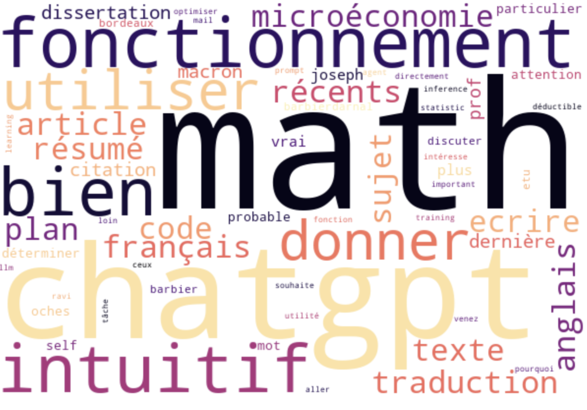

 

# Projects

You can find here some of my projects. I've tried to make them as diverse as possible, so you can see what I'm capable of. I've also tried to make them as fun as possible, so you can enjoy them!

 

Vocal assistant for an exposure in Berlin

***

    

  

On the occasion of a **photo exhibition** at the French Institute in Berlin, Maurice Lebrun and I created a staging that allows us to talk with the late Douanier Rousseau. Maurice is a French photographer who has been working on creating photos inspired by the Douanier Rousseau's paintings.

We met by chance, and he told me he'd like it to be possible to **talk to Henri Rousseau** during his exhibition. It was more difficult than expected, but the result is great!

    

  

In concrete terms, we've created a relatively simple architecture, "connecting" a **speech-to-text** model, **GPT4** prompted, and a **text-to-speech** model. The whole thing is assembled on a PureData + Streamlit interface, in a dedicated room within the exhibition. It took a lot of work, but the final result is really satisfying!

*Images are from Maurice Lebrun*

  

NLP web application

***

I've created a Streamlit web application that automates a lot of different **NLP tasks**.

<iframe src="https://no-code-nlp.streamlit.app/?embed=true" height="450" style="width:100%;border:none;"></iframe>

With it, you can:
- Apply sentiment analysis to a text
- Create wordclouds
- Use regular expressions to find specific elements in a text
- Measure similarity between two texts

    

  

Fun recipe generator

***

I've created a recipe generator that uses **OpenAI API** to generate recipes and images of it.

<iframe src="https://recipe-generator-josephbarbier.streamlit.app/?embed=true" height="450" style="width:100%;border:none;"></iframe>

If you don't know what to **cook** and want to have a **laugh**, you can try it out!

  