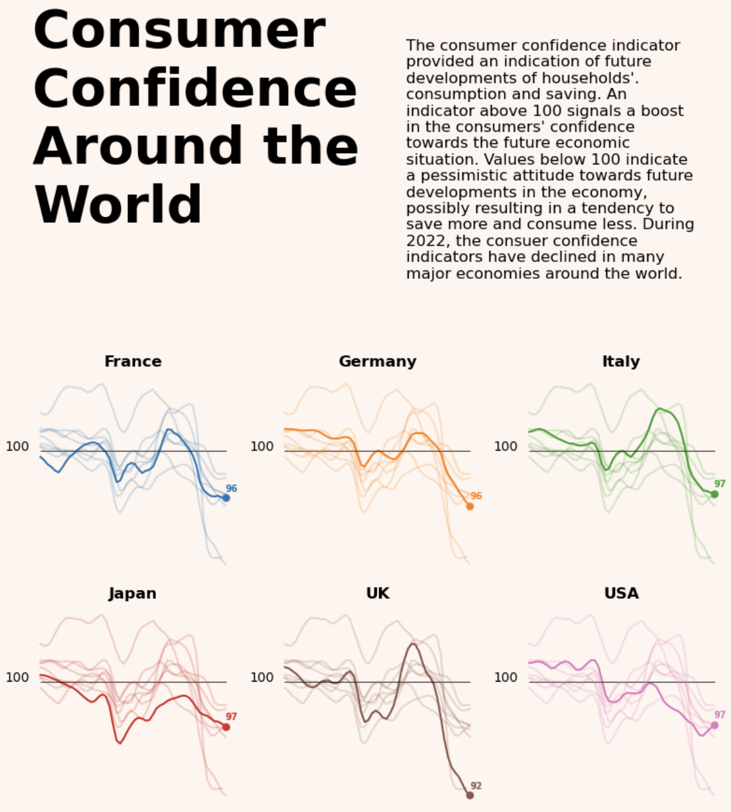
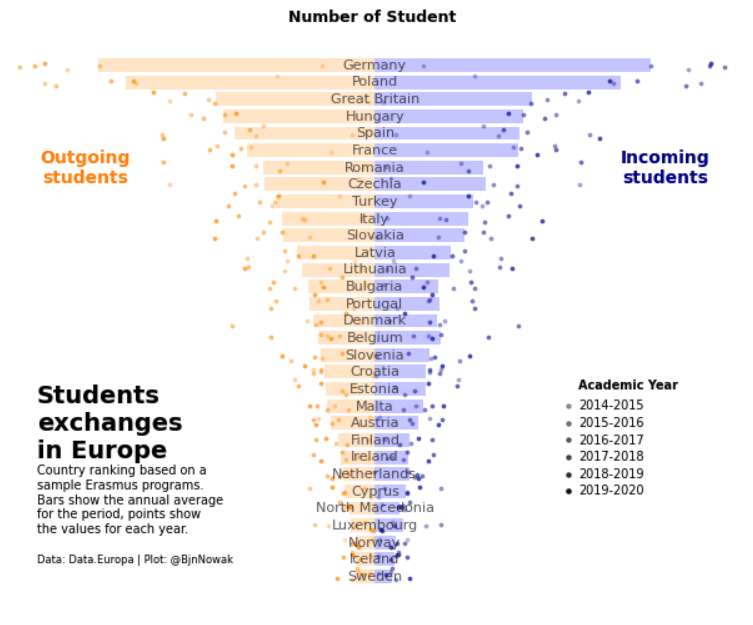
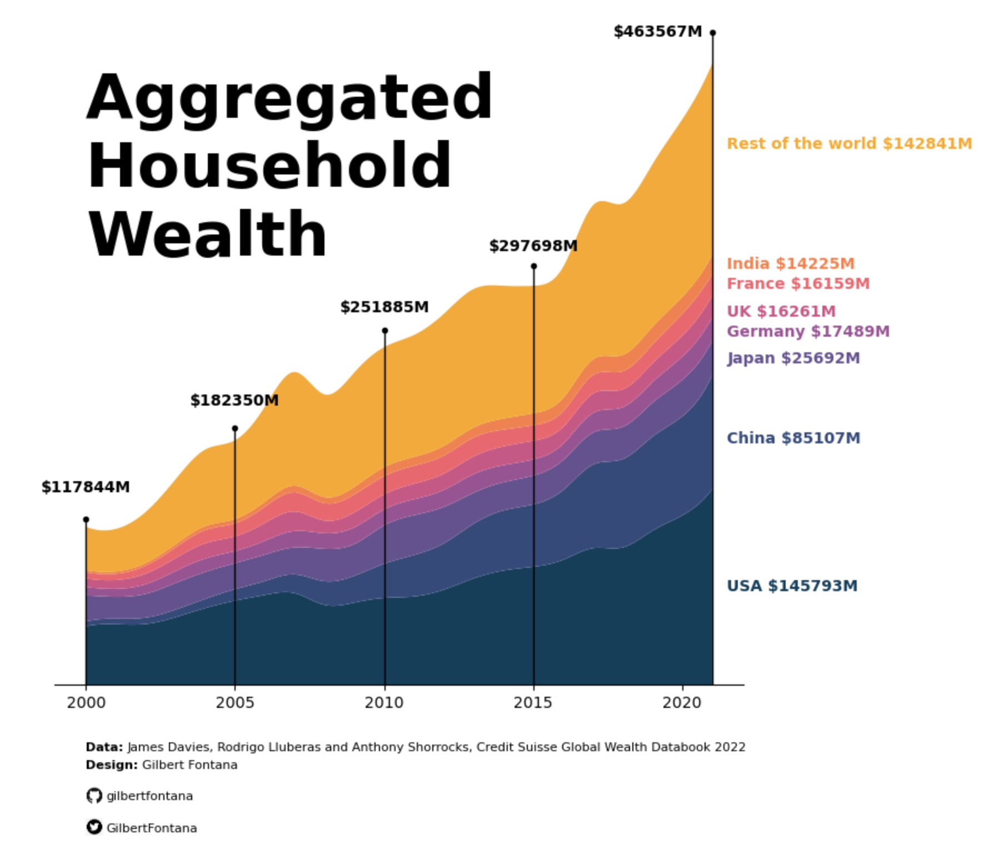
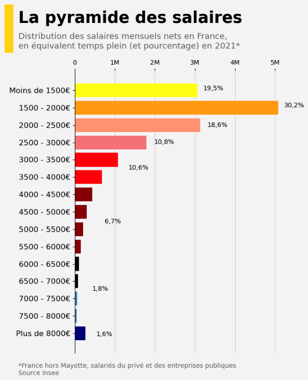
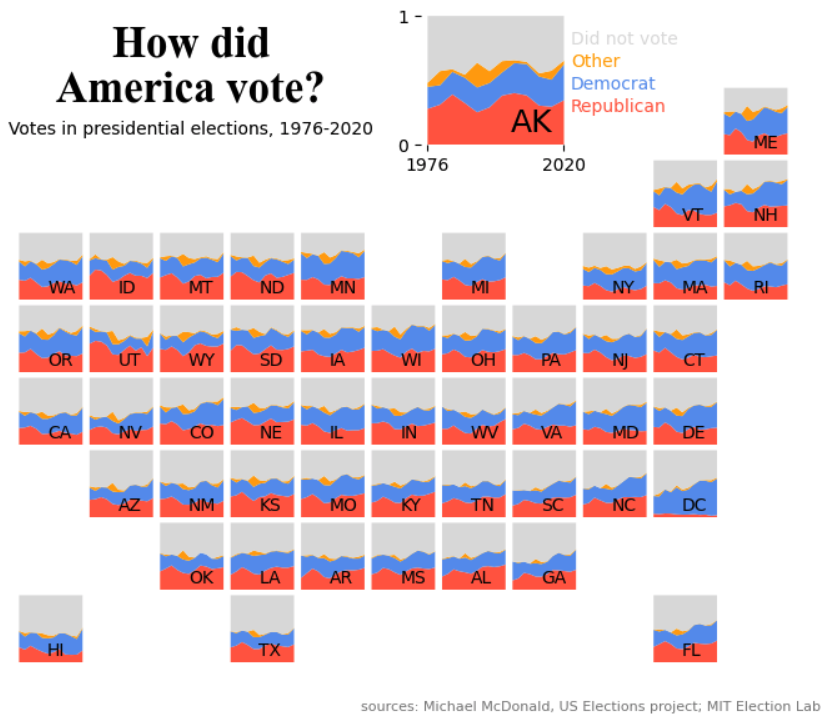
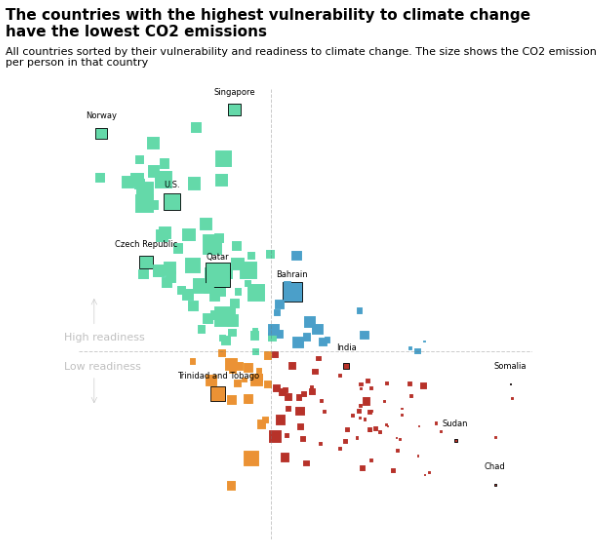

 

Statistical Journey

***
 

    Whether in artificial intelligence, philosophy, social sciences, physics and probably
    many other fields, statistics are indispensable. I am convinced that statistics, in the
    broadest sense of the term, is an indispensable tool to master when one is interested
    in understanding the world. You don't need to be an expert in mathematics, but only to
    develop this intuition and this way of reasoning. 

    On this website I decided to put non-technical articles about statistics and tutorials
    about maths and programming. The goal of these articles is to facilitate the work of
    those who need to understand and use data analysis tools as well as participate in the
    development of a culture of statistics.

   

    
    
Joseph Barbier

 

    I'm really excited about <b>science and epistemology</b>. I love working in a technical environment
    and I'm interested in perhaps anything that has anything to do with knowledge. I am particularly interested in topics such as: how statistics
    allow us to make <b>inferences</b>, the impact of <b>large language models</b> and more generally data mining.
    In my remaining free time, I do sport, read and spend time with my friends. 

    I’m currently working as a <strong>dataviz developer</strong> for the <a href="https://python-graph-gallery.com">Python</a>
    and <a href="https://r-graph-gallery.com">R</a> Graph Galleries, in a <strong>master’s program</strong> in applied mathematics at Bordeaux University
    and working on various <a href="About/projects.md">personal projects</a>.

   

Service

***
 

I offer <strong>data analysis</strong> and <strong>data visualization</strong> services. I can help you to <strong>understand your data</strong> and create <strong>beautiful visualizations</strong>. Here are some examples of charts I made:

 

    
    
    
    
    
    

 

If that's something you're interested in, feel free to contact me at joseph.barbierdarnal@gmail.com and I'd be happy to discuss it with you.

   

# Contact

    
    
    
  

