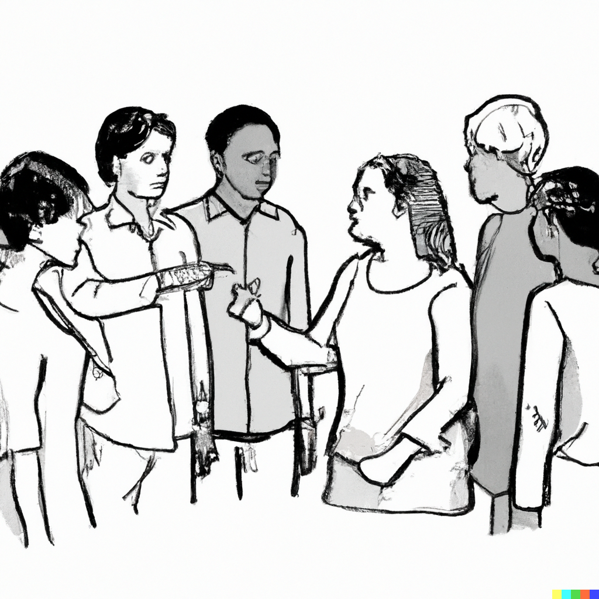
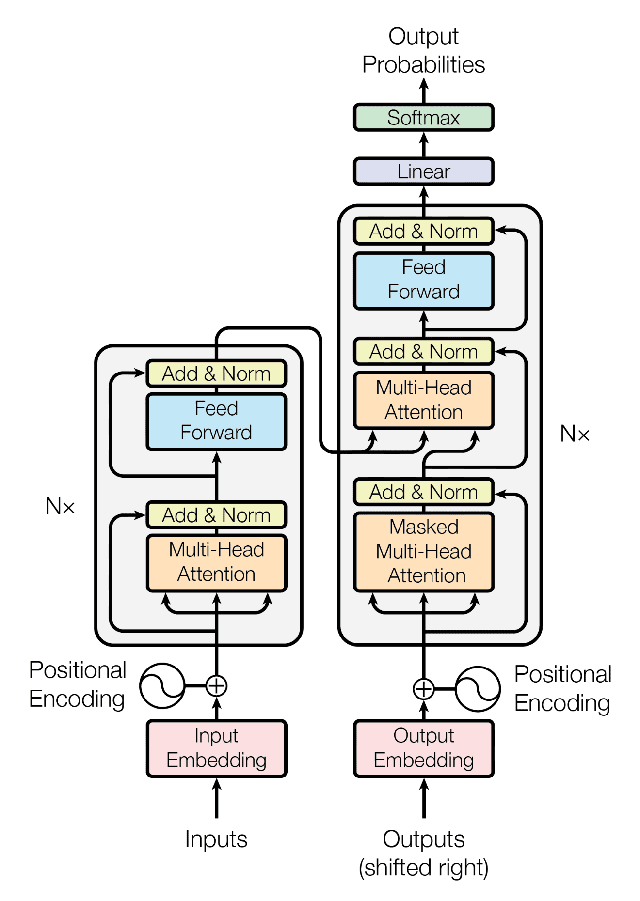

 

Statistical Journey

***
 

This website is currently <strong>under construction</strong>. I am working on it to make it available as soon as possible.

For the moment, you can check the <a href="about.html">about page</a> to know more about me and this website. Below, you can find some articles that I wrote. Many others have already been written and should be arriving soon!

   

Articles

***
  

    
        

            
Statistics in our daily life

                

                    
Because stats might seem reserved only for some people, I want to give you the taste of how it feels to think like a statistician.

                    
Check out <a href="Articles/statistics-in-our-daily-life.html">Statistics in our daily life</a>

                

        

 

  

    
        

            
Why you should be careful when doing statistics

                

                    
This article explains why every statistical calculation should be done for specific, well-defined reasons. In other words, you need to know why you’re doing what you’re doing.

                    
Check out <a href="Articles/be-careful-when-doing-statistics.html">Be careful when you're doing statistics</a>

                

        

 

  

    
        

            
ChatGPT's metric is not truthfulness

                

                    
ChatGPT does not try to be right, is probably not the solution to your problem and is a good example of the current problem with large language models.

                    
Check out <a href="Articles/chatgpt-metric-is-not-truthfulness.html">ChatGPT's metric is not truthfulness</a>

                

        

 

  

    
        

            
How to self-study statistics (without it being boring)?

                

                    
A short guide that explains some tips for learning statistics and making sure it's not boring. Do you have to do math? Should you read books? Start a project?

                    
Check out <a href="Articles/how-self-study-statistics.html">How to self-study statistics</a>

                

        

 

  

    
        

            
Impact of the transformer architecture

                

                    
The original paper associated with the transformer architecture has had a major impact on technical innovation. However, these models cannot be interpreted, yet they are deployed on a large scale.

                    
Check out <a href="Articles/impact-of-transformer-architectures.html">Impact of the transformer architecture</a>

                

        

 

  

  