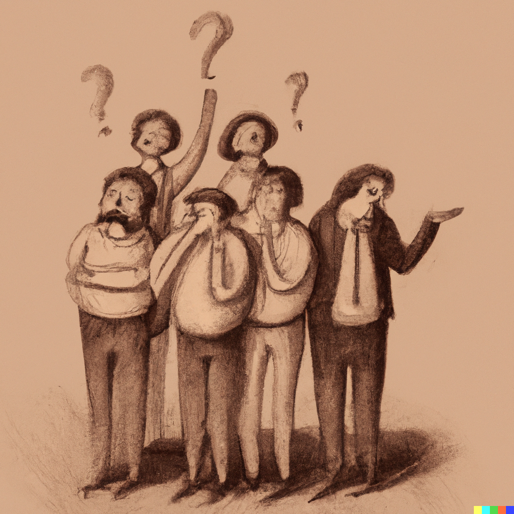

 

Statistical Journey

***
 

This website is currently under construction. I am working on it to make it available as soon as possible.

For the moment, you can check the <a href="about.md">about page</a> to know more about me and this website. Below, you can find some articles that I wrote. Many have already been written and should be arriving soon!

   

    
        

            
Statistics in our daily life

                

                    
Because stats might seem reserved only for some people, I want to give you the taste of how it feels to think like a statistician.

                    
Check out <a href="Articles/statistics-in-our-daily-life.md">Statistics in our daily life</a>

                

        

 

  

## Be careful when doing statistics

This article explains why every statistical calculation should be done for specific, well-defined reasons. In other words, you need to know why you are doing this test in this situation, why you are using this regression, what your calculations really mean, and more generally, why you’re doing what you’re doing.

Check out [be careful when doing statistics](Articles/be-careful-when-doing-statistics.md) to see why you should be very careful when doing statistics.

  

## ChatGPT's metric is not truthfulness

ChatGPT does not try to be right, is probably not the solution to your problem and is a good example of the current problem with large language models. Here's why you should be skeptical of its answers.

Check out [ChatGPT's metric is not truthfulness](Articles/chatgpt-metric-is-not-truthfulness.md) to see why ChatGPT's metric is not truthfulness.

  