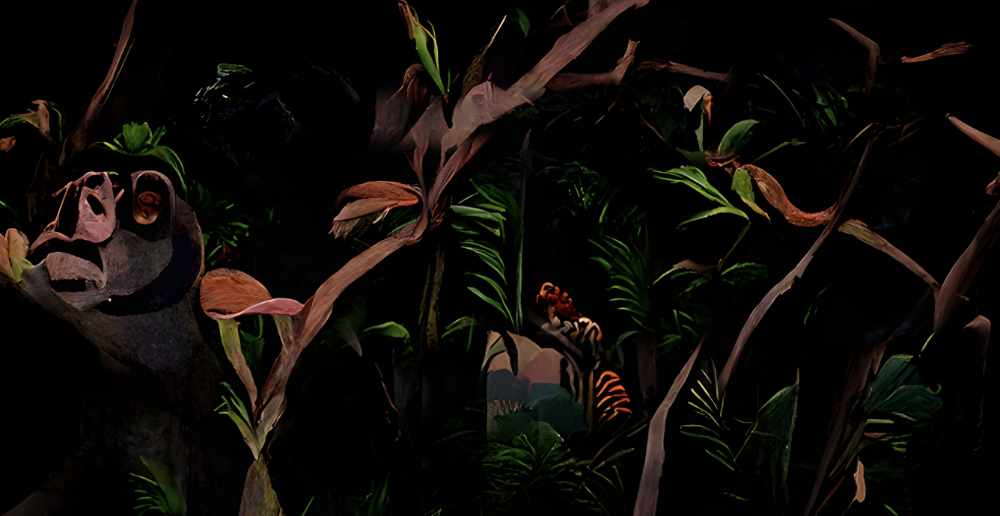
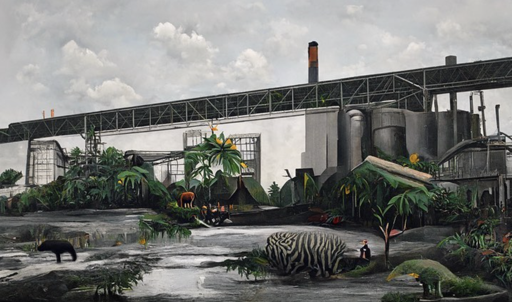

 

Personal projects

You can find here some of my projects that I've done to learn new things, for fun or to help people.

  

Vocal assistant for an exposure in Berlin

 

    

  

On the occasion of a <b>photo exhibition</b> at the French Institute in Berlin, Maurice Lebrun and I created a staging that allows us to talk with the late Douanier Rousseau. Maurice is a French photographer who has been working on creating photos inspired by the Douanier Rousseau's paintings.   We met by chance, and he told me he'd like it to be possible to <b>talk to Henri Rousseau</b> during his exhibition. It was more difficult than we expected, but the result is great!

    

  

In concrete terms, we've created a relatively simple architecture, "connecting" a <b>speech-to-text</b> model, <b>GPT4</b> prompted, and a <b>text-to-speech</b> model. The whole thing is assembled on a PureData + Streamlit interface, in a dedicated room within the exhibition. It took a lot of work, but the final result is really satisfying!

*Images are from Maurice Lebrun*

   

Natural Language Processing web application

 

<iframe src="https://no-code-nlp.streamlit.app/?embed=true" height="450" style="width:100%;border:none;"></iframe> 

I've created a Streamlit web application that automates a lot of different <b>NLP tasks</b>. With it, you can:
    <ul style="font-size: 23px;">
        <li>Apply sentiment analysis to a text</li>
        <li>Create wordclouds</li>
        <li>Use regular expressions to find specific elements in a text</li>
        <li>Measure similarity between two texts</li>
    </ul>

   

Fun recipe generator

 

<iframe src="https://recipe-generator-josephbarbier.streamlit.app/?embed=true" height="450" style="width:100%;border:none;"></iframe>  

I've created a recipe generator that uses <b>OpenAI API</b> to generate recipes and images of it.  If you don't know what to <b>cook</b> and want to have a <b>laugh</b>, you can try it out!

   

A website to learn about statistics

 

I've created a website to learn about statistics, for everyone. It's called <a href="https://statisticaljourney.com">Statistical Journey</a> and you are currently on it!
 

On this website I decided to put non-technical articles about statistics. The goal of these articles is to facilitate the work of those who need to understand and use data analysis tools as well as participate in the development of a culture of statistics.

For the moment, there are "just" a few articles, but it takes lots of time to write them and I want them to be of good quality.
 

   

University projects

 

I've done lots of projects during my studies. I put my favorites here.
 

    <ul style="font-size: 23px;">
        <li><strong>Cleaning and analysis of research papers</strong>, all done with R in my <i>Introduction to R programmig</i> course. Final rendering can be found <a href="https://github.com/JosephBARBIERDARNAL/Code-iref-1semester/blob/main/R-project.R">here</a>.</li>
        <strong>Keywords</strong>: R, natural language processing, regular expressions, data cleaning  
        

            
        
   
        <li><strong>Database cleaning automation</strong>, with Python for my <i>Data processing tools</i> course. With a fellow student, we've created a web app to clean up the <a href="https://share-eric.eu">SHARE</a> database (Europe's largest social science study). </li>
        <strong>Keywords</strong>: python, streamlit, missing values and outliers management, UI/UX  
        

            
        
   
        <li><strong>Handling a major missing values problem</strong>, in partnership with Caisse des Dépôts et Consignations, for my <i>Big data</i> course. Our approach used text similarity methods to associate the semantically closest values with the missing ones.</li>
        <strong>Keywords</strong>: python, natural language processing, text similarity, missing values management  
        

            
        
   
    </ul>

   

