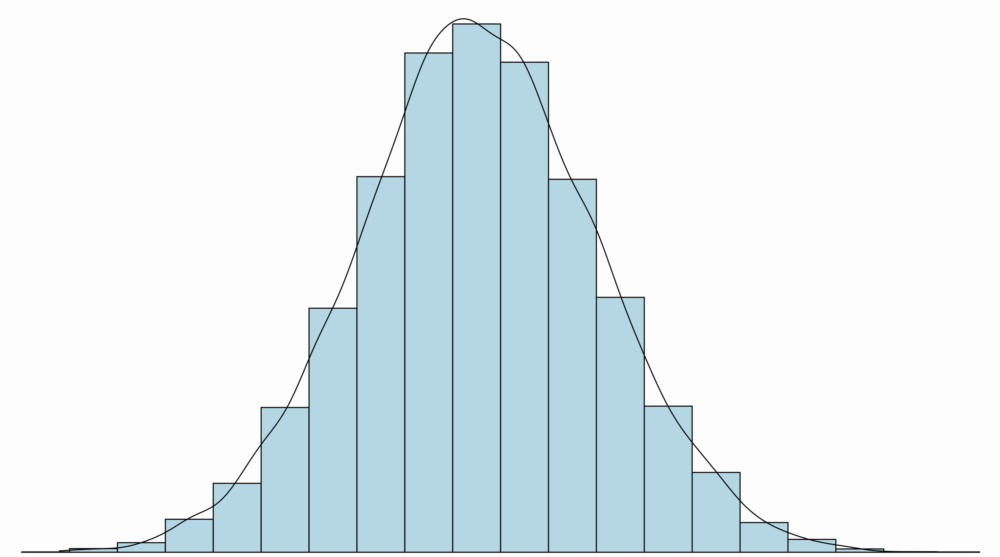

 

Tutorials

***
 

This section is still <strong>under construction</strong>.

You can find here various tutorials related to statistics, programming or data.

   

Topics

***
  

        

            <a href="https://example.com">
                

                    
                

            </a> 
            
<a href="tutorials/statistics.html">Statistics</a>

        

        

            <a href="https://example.com">
                

                    
                

            </a> 
            
<a href="tutorials/programming.html">Programming</a>

        

        

            <a href="https://example.com">
                

                    
                

            </a> 
            
<a href="tutorials/data.html">Data</a>

        

    

